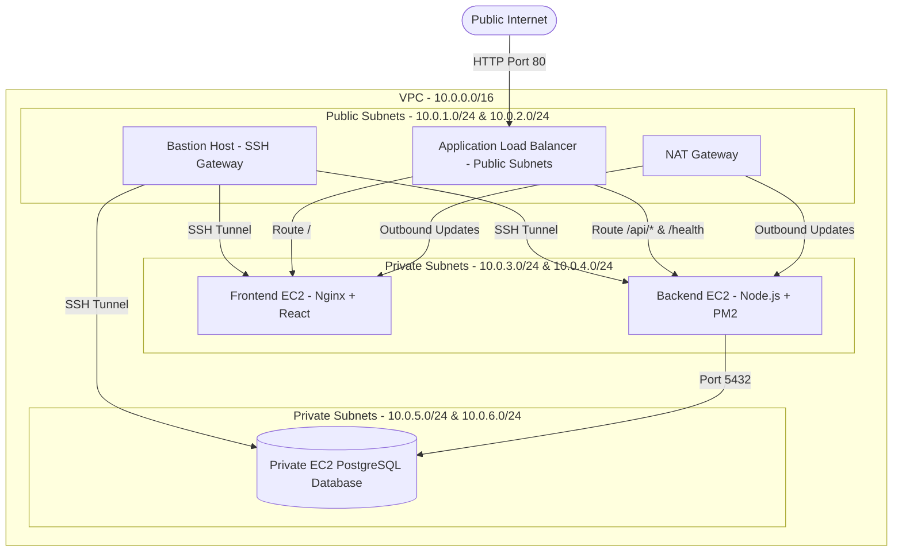

# Master Deployment Guide — 3-Tier Infrastructure with IaC, CI/CD, and Monitoring

This guide provides a comprehensive, step-by-step walkthrough to deploy the consolidated **mahmud_assignment_6** full-stack 3-tier application (React + Node.js + PostgreSQL) on AWS using **Terraform (IaC)**, automate deployments via **GitHub Actions (CI/CD)** running on a GitHub-hosted runner (`ubuntu-latest`), and monitor system metrics using **Prometheus and Grafana**.

The infrastructure and scripts are optimized to deploy reliably on **restricted AWS IAM Training Accounts** by bypassing RDS permission restrictions (`rds:CreateDBSubnetGroup` and `rds:CreateDBParameterGroup`) and using a private EC2 instance running PostgreSQL in your database subnet. It also routes traffic directly over **HTTP Port 80** and leverages your existing key pair **`ostad_batch_11_mahmud`**.

---

## 🏗️ 1. Infrastructure Overview (3-Tier Architecture)



- **Public Tier**: Standard Application Load Balancer (ALB) that handles ingress routing, and a Bastion Host that acts as a secure SSH jump gateway.
- **Application Tier (Private)**: Frontend React Nginx web servers and Backend Express Node.js application servers, completely shielded from direct public internet exposure. Outbound access is provided via NAT Gateway for security patches and dependencies.
- **Database Tier (Private)**: Fully isolated EC2 PostgreSQL database instance inside private database subnets, accessible ONLY from the backend security group.

---

## 🚀 Step 1: AWS Credentials & Local CLI Setup

### 1.1 Configure AWS CLI
Ensure that the AWS CLI is installed on your local computer. Open your terminal or PowerShell and run the following command to configure it with the credentials provided for your training program:

```bash
aws configure
```

Input the parameters as follows:
- **AWS Access Key ID**: `[Your Access Key]`
- **AWS Secret Access Key**: `[Your Secret Access Key]`
- **Default region name**: `ap-south-1`
- **Default output format**: `json`

*(Note: Verify your active identity by running `aws sts get-caller-identity` to confirm communication).*

---

## 🛠️ Step 2: Provisioning AWS Resources with Terraform

The infrastructure is modular and configured to use standard local state by default for ease of training execution.

### 2.1 Navigate to the Prod Environment
Open your terminal and navigate to the production environment folder inside the new directory:

```bash
cd mahmud_assignment_6/terraform/environments/prod
```

### 2.2 Initialize Terraform
Initialize the project, which downloads the necessary AWS and random provider plugins:

```bash
terraform init
```

### 2.3 Validate & Plan the Configuration
Run a validation check to verify formatting and construct the dry-run execution plan:

```bash
terraform validate
terraform plan
```

### 2.4 Apply the Changes
Deploy the stack. This will provision your VPC, Route Tables, NAT Gateways, Security Groups, EC2 nodes, ALB, and Database:

```bash
terraform apply -auto-approve
```

---

## 🔑 Step 3: Accessing Outputs & Connecting Over SSH

Once the deployment completes successfully, Terraform will output the details of your infrastructure:

- **`app_url`**: The direct HTTP Load Balancer URL (e.g. `http://mahmud-health-prod-alb-XXXXXX.ap-south-1.elb.amazonaws.com`).
- **`bastion_public_ip`**: The public IP address of your Bastion gateway.
- **`frontend_private_ip`**: The isolated private IP of your Nginx frontend.
- **`backend_private_ip`**: The isolated private IP of your Node.js backend.
- **`db_private_ip`**: The isolated private IP of your PostgreSQL database EC2.

### 3.1 Connecting to Private Nodes via Bastion (ProxyJump)
Your PEM key `ostad_batch_11_mahmud.pem` is already in the project directory. Keep it secure and run these commands to SSH:

```bash
# Connect to the Bastion Host directly:
ssh -i ostad_batch_11_mahmud.pem ubuntu@BASTION_PUBLIC_IP

# Connect to the Private Backend Instance via ProxyJump:
ssh -i ostad_batch_11_mahmud.pem -J ubuntu@BASTION_PUBLIC_IP ubuntu@BACKEND_PRIVATE_IP

# Connect to the Private Frontend Instance via ProxyJump:
ssh -i ostad_batch_11_mahmud.pem -J ubuntu@BASTION_PUBLIC_IP ubuntu@FRONTEND_PRIVATE_IP

# Connect to the Private Database Instance via ProxyJump:
ssh -i ostad_batch_11_mahmud.pem -J ubuntu@BASTION_PUBLIC_IP ubuntu@DB_PRIVATE_IP
```

---

## 🔄 Step 4: Configuring GitHub Actions CI/CD Pipeline

The `.github/workflows/deploy.yml` pipeline runs on every code push to the `main` branch. It executes on a GitHub-hosted runner (`ubuntu-latest`) and deploys code changes directly to your private subnet instances using SSH ProxyJump via your Bastion Host.

### 4.1 Set up GitHub Repository Secrets
Navigate to your repository on GitHub, go to **Settings > Secrets and Variables > Actions**, and click **New repository secret** to add these 7 secrets:

| Secret Name | Value |
|-------------|-------|
| `EC2_SSH_KEY` | Paste the *entire* raw text content of your `ostad_batch_11_mahmud.pem` private key. |
| `EC2_BASTION_HOST` | The public IP of the Bastion Host. |
| `EC2_FRONTEND_HOST` | The private IP of the Frontend EC2 instance (e.g., `10.0.4.x`). |
| `EC2_BACKEND_HOST` | The private IP of the Backend EC2 instance (e.g., `10.0.3.x`). |
| `DB_PRIVATE_IP` | The private IP of your Database EC2 instance (e.g., `10.0.5.x`). |
| `DB_PASSWORD` | The master database password (generated by Terraform or custom). |
| `ALB_DNS_NAME` | The direct DNS name of the ALB (without `http://`). |

### 4.2 Push Code to Trigger CI/CD
Initialize git in your folder and push the code:

```bash
git init
git add .
git commit -m "feat: consolidate project and setup modular iaC with CI/CD"
git remote add origin https://github.com/YOUR_USERNAME/YOUR_REPO_NAME.git
git branch -M main
git push -u origin main
```

Watch the pipeline build, run schema migrations, bundle React static pages, restart PM2, and verify that the load balancer returns a healthy HTTP `200` status.

---

## 📊 Step 5: Setting Up Grafana & Prometheus Monitoring (Bonus)

To monitor infrastructure metrics (CPU, Memory, Disk, Network) and database connections, we use the pre-packaged idempotent telemetry scripts.

### 5.1 Step A: Install Exporters on the Application Server
SSH into your **Private Backend EC2** (via Bastion) and run the application exporter setup script:

```bash
cd /home/ubuntu/bmi-health-tracker
sudo chmod +x monitoring/3-tier-app/scripts/setup-application-server.sh
sudo ./monitoring/3-tier-app/scripts/setup-application-server.sh
```
*When prompted, enter the Private IP of the monitoring host.*

### 5.2 Step B: Deploy Prometheus + Grafana Stack
In standard production, a separate EC2 node or container host runs the monitoring stack. If deploying the monitoring stack on a public EC2 instance, SSH into that instance and run:

```bash
cd /home/ubuntu/bmi-health-tracker
sudo chmod +x monitoring/3-tier-app/scripts/setup-monitoring-server.sh
sudo ./monitoring/3-tier-app/scripts/setup-monitoring-server.sh
```
*When prompted, enter the Private IP of the Application Server.*

This installs:
- **Prometheus** (Port `:9090`) to scrape system metrics.
- **Grafana** (Port `:3001`) with preloaded dashboards.
- **Loki & Promtail** for secure, aggregated log shipping.

### 5.3 Verification Checklist
- **Prometheus Targets**: Visit `http://MONITORING_HOST_IP:9090/targets` to verify all exporters are `UP`.
- **Grafana Dashboards**: Access `http://MONITORING_HOST_IP:3001` (Default login: `admin` / `admin`). View graphs detailing CPU usage, memory thresholds, Nginx request latencies, and custom database metric sweeps!

---

## 🧪 Step 6: Manual Verification & Testing

### 6.1 Test the Application Endpoints
Open your browser and navigate to your Load Balancer's direct DNS name (the `app_url` output).
1. **Frontend Verification**: The page should load instantly showing the React BMI & Health Tracker form.
2. **Backend API Verification**: Navigate to `http://[ALB_DNS_NAME]/health` — it should return:
   ```json
   {"status":"ok","environment":"production"}
   ```
3. **Database Connectivity Verification**: Submit a health record (Weight, Height, Age, Activity level) on the frontend. The record should immediately persist in your private PostgreSQL database and show up in the history trend list.

### 6.2 Check Migration Log Tables
Connect to your database via Bastion and run SQL commands to inspect tables:
```bash
# Connect to PostgreSQL from the Backend server:
psql -h [DB_PRIVATE_IP] -U bmi_user -d bmidb

# Select from measurements table:
SELECT id, weight_kg, height_cm, bmi, measurement_date FROM measurements;
```

---

## 🧹 Step 7: Clean Destruction

To avoid any ongoing costs in your training account, destroy all resources when your assignment review is completed:

```bash
cd mahmud_assignment_6/terraform/environments/prod
terraform destroy -auto-approve
```
*(All resources including VPC, gateways, and EC2 nodes will be terminated cleanly).*
