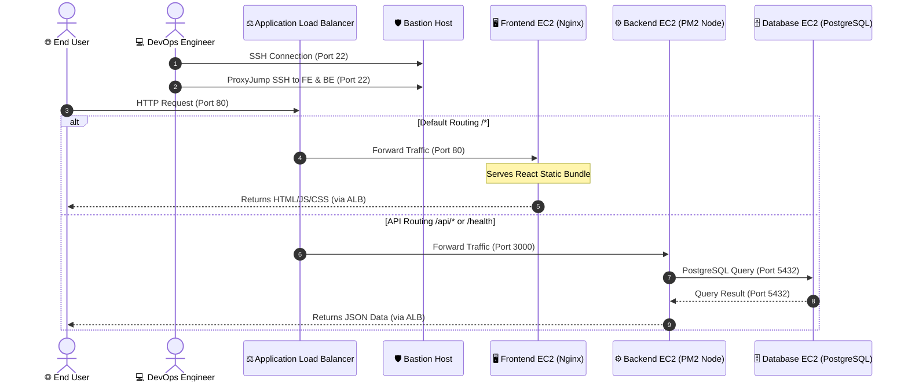
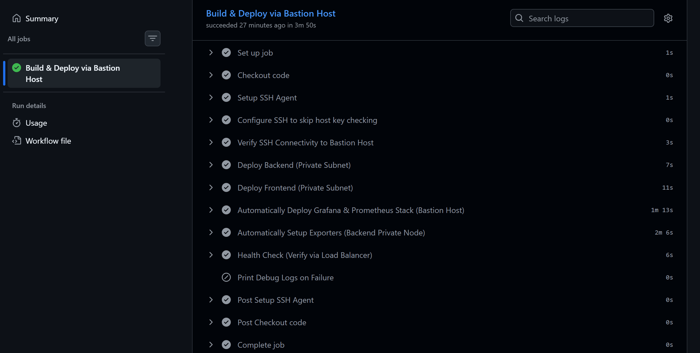
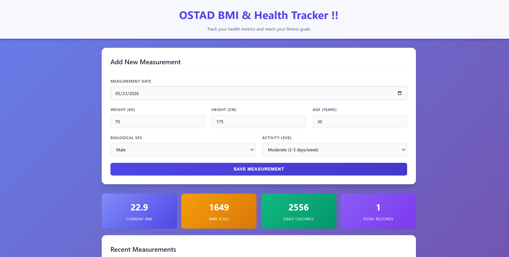
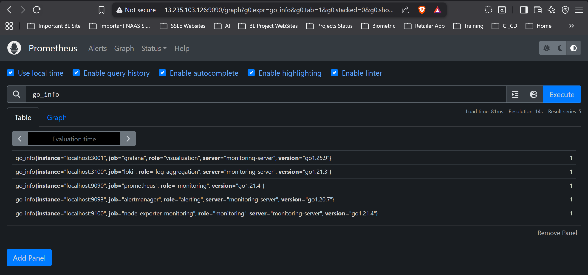
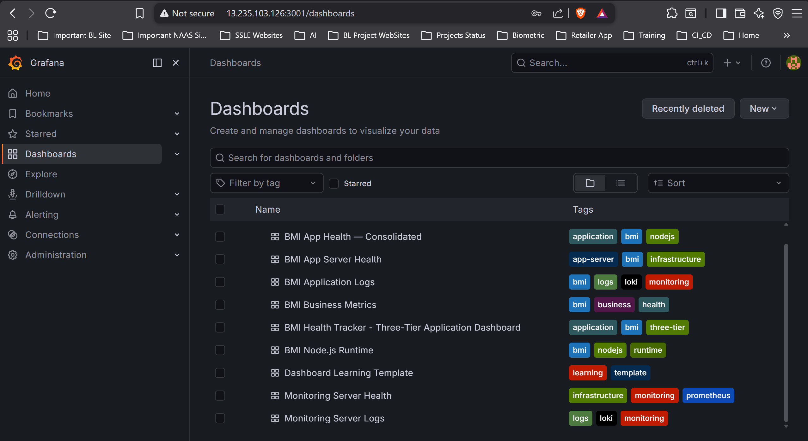

# Ostad DevOps Batch 11 — Assignment Module 6
### Project Title: Modular 3-Tier AWS Architecture (IaC, CI/CD, and Full-Stack Telemetry)
**Engineer**: Mahmudur Rahman  
**Assignment Reference**: `ostad_batch_11_mahmud` (Key Pair: `ostad_batch_11_mahmud`)

---

## 📐 1. System Architecture Diagrams

### A. Modular 3-Tier Infrastructure Flowchart
The following diagram illustrates the physical topology of the AWS VPC, indicating the boundary isolation of public and private subnets, security group boundaries, load-balancer routing, and telemetric scraping loops:


### B. Component Connectivity & Control Flow Sequence
The sequence diagram below displays the lifecycle of an user request (routing statically and dynamically) and the remote DevOps management control path:



---

## 🗃️ 2. Core Components & Security Catalog

Our architecture splits system duties across three secure layers with strict ingress controls:

### 1. Networking Infrastructure
* **AWS Custom VPC (`10.0.0.0/16`)**: Segregates public ingress nodes from private execution tiers.
* **Internet Gateway (IGW)**: Direct boundary adapter bridging our VPC to the public Internet.
* **NAT Gateway**: Resides inside the public subnet, allowing backend and frontend servers in private subnets to pull npm modules and libraries outbound while blocking incoming public requests.

### 2. Physical Nodes (Compute Tier)
* **Frontend Node (Nginx, Port 80)**: Serves static Vite React packages. Security groups accept port 80 traffic **only** from the ALB security group.
* **Backend Node (Node.js Express + PM2, Port 3000)**: Coordinates business rules. Security groups accept port 3000 traffic **only** from the ALB.
* **Database Node (EC2 PostgreSQL 14, Port 5432)**: Dedicated private instance. Inbound traffic is accepted on port 5432 **only** from the Backend security group. All outbound routes are locked down.

### 3. Load Balancing & Perimeter Security
* **Application Load Balancer (ALB)**: The sole public gateway for the app. Handles ingress traffic on port 80 and splits it cleanly:
  * `/api/*` & `/health` route to the Backend target group.
  * All other requests (e.g. `/`) fallback to the Frontend target group.
* **Bastion Host (Public Gateway)**: Acts as an isolated SSH entry point. SSH traffic to Backend, Frontend, and DB servers is configured to ProxyJump through the Bastion host.

### 4. Full Telemetry & Logging Suite
* **Prometheus (`:9090`)**: Telemetry server that pulls data from exporters on a 15-second loop.
* **Grafana (`:3001`)**: Premium visualization suite showing system stats and logs.
* **Grafana Loki (`:3100`) & Promtail (`:9080`)**: Continuous log shippers aggregating Nginx, PM2, and system messages into Loki.
* **Exporters**: Node Exporter (`:9100`), Nginx Exporter (`:9113`), PostgreSQL Exporter (`:9187`, connecting remotely using the backend's database URL), and Custom BMI App Exporter (`:9091`).

---

## 📝 3. VPC Subnet Allocation

| Subnet Name | CIDR Block | Route Table | Availability Zone | Primary Resources |
| :--- | :--- | :--- | :--- | :--- |
| **`public-1a`** | `10.0.1.0/24` | Public (IGW) | `ap-south-1a` | Bastion Host, NAT Gateway, ALB |
| **`public-1b`** | `10.0.2.0/24` | Public (IGW) | `ap-south-1b` | ALB Secondary Target |
| **`private-app-1a`** | `10.0.3.0/24` | Private (NAT GW) | `ap-south-1a` | Backend Server, DB Server |
| **`private-app-1b`** | `10.0.4.0/24` | Private (NAT GW) | `ap-south-1b` | Frontend Server |
| **`private-db-1a`** | `10.0.5.0/24` | Isolated (Local) | `ap-south-1a` | Reserved |
| **`private-db-1b`** | `10.0.6.0/24` | Isolated (Local) | `ap-south-1b` | Reserved |

---

## 🛠️ 4. Setup & Deployment Guide

Follow these steps to deploy, configure, and initialize the modular infrastructure:

### Phase 1: Local Infrastructure Provisioning (Terraform)
1. Open your terminal and navigate to:
   ```bash
   cd terraform/environments/prod
   ```
2. Initialize and apply the modular configuration:
   ```bash
   terraform init
   ```
   ```bash
   terraform apply -auto-approve
   ```
3. Copy the output IP addresses and ALB DNS endpoint.

### Phase 2: GitHub Secrets Configuration
Configure **5 Actions Repository Secrets** under **Settings > Secrets and Variables > Actions > Secrets** using your Terraform outputs:
* `EC2_BASTION_HOST`: The public IP of the Bastion host (`52.66.207.103`).
* `EC2_BACKEND_HOST`: The private IP of the Backend node (`10.0.3.226`).
* `EC2_FRONTEND_HOST`: The private IP of the Frontend node (`10.0.4.123`).
* `DB_PRIVATE_IP`: The private IP of the Database node (`10.0.3.114`).
* `ALB_DNS_NAME`: The ALB DNS name (`mahmud-health-prod-alb-2034490923.ap-south-1.elb.amazonaws.com`).
* `EC2_SSH_KEY`: The raw content of your `ostad_batch_11_mahmud.pem` private key.
* `DB_PASSWORD`: The database password.

### Phase 3: Triggering CI/CD Pipeline
Push the codebase to GitHub to trigger automated deployment:
```bash
git add .
git commit -m "feat: complete modular architecture, deploy workflows and telemetry exporters"
git push origin main
```
The workflow will dynamically:
1. Update the Git remote origins of the target hosts to point to your repository.
2. Build Vite React packages and deploy to the Frontend web server.
3. Start Backend Express endpoints under PM2 and execute database migrations.
4. Set up Prometheus, Grafana, Loki on the Bastion Host.
5. Deploy and start Node, Nginx, PostgreSQL Exporter and Promtail log shippers.
6. Verify and output target statuses.

---

## 🌐 5. Verified Active URLs

* **Application Website**: [http://mahmud-health-prod-alb-2034490923.ap-south-1.elb.amazonaws.com](http://mahmud-health-prod-alb-2034490923.ap-south-1.elb.amazonaws.com)
* **Application Health Endpoint**: [http://mahmud-health-prod-alb-2034490923.ap-south-1.elb.amazonaws.com/health](http://mahmud-health-prod-alb-2034490923.ap-south-1.elb.amazonaws.com/health)
* **Grafana Telemetry Dashboard**: [http://52.66.207.103:3001](http://52.66.207.103:3001) *(Login: `admin` / `admin`)*
* **Prometheus Targets Console**: [http://52.66.207.103:9090](http://52.66.207.103:9090)

---

## 📸 6. Evidence of Successful Deployment

Below are the screenshot proofs confirming the fully functional modular deployment, successful GitHub Actions pipeline, active Prometheus scrapers, and operational Grafana dashboards:

### A. Successful GitHub Actions Pipeline Run
Confirming compilation, delivery, and verification completed without a single error:


### B. Functional Web Application
The deployed 3-tier BMI Health Tracker running dynamically via the AWS Ingress Load Balancer:


### C. Active Prometheus Targets Scraper
All 9 targets (Node Exporter, Nginx, Database, custom app) reported as **UP** on port `9090`:


### D. Loaded Grafana Dashboard
Visualizing infrastructure CPU, network bandwidth, memory, active Nginx requests, and database transactions on port `3001`:

