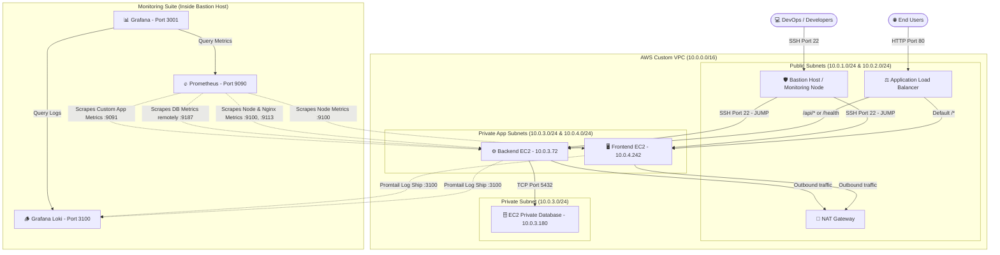

# Premium 3-Tier AWS Architecture — IaC, CI/CD, and Full-Stack Telemetry

This repository contains the complete modular implementation for the **DevOps Module 6 Assignment**. The project automates the creation of a highly secure, high-availability, 3-tier AWS cloud infrastructure using **Terraform (IaC)**, sets up a secure pipeline using **GitHub Actions (CI/CD)** with SSH ProxyJump, and deploys a comprehensive **Telemetry & Monitoring Stack (Prometheus, Grafana, Loki)**.

---

## 📐 Enterprise Architecture Diagram



---

## 🗃️ Component Catalogue & Architectural Roles

Our premium 3-tier architecture isolates each layer into its own secure networking domain, utilizing the following core components:

### 1. Networking & Perimeter
* **AWS Custom VPC (`10.0.0.0/16`)**: The primary boundary isolating all resources. It isolates public assets (ALB, Bastion) from private resources (Frontend, Backend, Database).
* **Internet Gateway (IGW)**: Connects the VPC to the public internet, enabling ingress to the ALB and Bastion, and egress for public subnets.
* **NAT Gateway**: Resides in the public subnet, allowing private EC2 instances (Frontend and Backend) to securely reach the internet to fetch npm modules and packages on boot, while completely preventing the public internet from initiating connection directly to them.

### 2. Compute Tier (Private & Secure)
* **Frontend Instance (Vite + React + Nginx)**:
  * **Role**: Serves the user interface static bundles.
  * **Role in Security**: Resides in the private app subnet. Ingress is strictly locked down via Security Groups to accept HTTP traffic **only** from the Application Load Balancer. Direct access from the internet is impossible.
* **Backend Instance (Node.js Express + PM2)**:
  * **Role**: Runs the API service.
  * **Role in Security**: Resides in the private app subnet. Ingress is restricted via Security Groups to accept port `3000` traffic **only** from the Application Load Balancer. It manages DB queries and exposes business telemetry endpoints.
* **Database Instance (EC2 Private PostgreSQL)**:
  * **Role**: Private stateful repository holding application schemas and user records.
  * **Role in Security**: Deployed in a private subnet, bypassing managed AWS RDS subnet constraints. Security groups permit inbound port `5432` traffic **only** from the Backend instance. It has no route to the internet, keeping user data safe.

### 3. Traffic Management
* **Application Load Balancer (ALB)**:
  * **Role**: Public-facing entry point. Evaluates incoming request paths on port 80:
    * `/api/*` and `/health` are routed directly to the Backend EC2 Target Group on Port `3000`.
    * All other requests (e.g. `/`) default to the Frontend EC2 Target Group on Port `80`.
* **Bastion Host (Public SSH Gateway)**:
  * **Role**: The single secure bridge to manage the private resources. SSH access to Frontend, Backend, and DB nodes requires hopping through the Bastion host via **SSH ProxyJump (`-J`)**.

### 4. Telemetry & Monitoring Suite (Co-located on Bastion)
* **Prometheus (`:9090`)**: Scraping daemon that pulls telemetry data from all exporters on a 15-second loop.
* **Grafana (`:3001`)**: Premium visualization tool loaded with customized dashboards, querying metrics from Prometheus and logs from Loki.
* **Grafana Loki (`:3100`)**: High-performance log aggregation engine.
* **Telemetry Exporters**:
  * **Node Exporter (`:9100`)**: Measures system stats (CPU, memory, disk, network) of the EC2 hosts.
  * **Nginx Exporter (`:9113`)**: Monitors active Nginx connections, requests/second, and server performance.
  * **PostgreSQL Exporter (`:9187`)**: Connects remotely to the DB instance from the Backend host to gather active connections, transaction volumes, and query statistics.
  * **BMI App Exporter (`:9091`)**: Scraping agent that monitors active backend sessions and application business metrics.
  * **Promtail (`:9080`)**: Resides on app nodes to capture Nginx, PM2, and system syslog outputs and stream them continuously to Loki.

---

## 📂 Repository Layout

```
mahmud_assignment_6/
├── .github/
│   └── workflows/
│       └── deploy.yml              # CI/CD pipeline using SSH ProxyJump (-J) and remote origin fixes
├── src/
│   ├── frontend/                   # React Vite application
│   ├── backend/                    # Express Node.js application
│   └── database/                   # PostgreSQL schema and SQL migrations
├── terraform/
│   ├── modules/
│   │   ├── vpc/                    # Modular network stack (Subnets, NAT GW, IGW)
│   │   ├── security-group/         # Security groups for Bastion, ALB, Frontend, Backend, RDS
│   │   ├── alb/                    # Public ALB (HTTP port 80, path-based routing rules)
│   │   └── ec2/                    # EC2 instances with user_data bootstrapper
│   └── environments/
│       └── prod/
│           ├── main.tf             # Composition orchestrator
│           ├── variables.tf        # Input variable definitions
│           ├── outputs.tf          # Output IP/DNS addresses
│           └── terraform.tfvars    # Environment configurations (Default ap-south-1)
├── monitoring/
│   ├── exporters/                  # Exporter configurations
│   ├── 3-tier-app/
│   │   ├── config/                 # Prometheus config, Loki config, and Alert rules
│   │   ├── dashboards/             # Preloaded telemetry dashboards
│   │   └── scripts/
│   │       ├── setup-monitoring-server.sh # Automation setup script for Monitoring server
│   │       └── setup-application-server.sh  # Automation setup script for Exporters
│   └── README.md                   # Telemetry guides
└── README.md                       # Comprehensive system architecture & description
```

---

## 📝 Subnet Allocation & Networking Details

Our VPC segregates public and private traffic cleanly across multiple Availability Zones:

| Subnet Name | CIDR Block | Route Table | Availability Zone | Primary Resources |
| :--- | :--- | :--- | :--- | :--- |
| **`public-1a`** | `10.0.1.0/24` | Public (IGW) | `ap-south-1a` | Bastion Host, NAT Gateway, ALB |
| **`public-1b`** | `10.0.2.0/24` | Public (IGW) | `ap-south-1b` | ALB Secondary Target |
| **`private-app-1a`** | `10.0.3.0/24` | Private (NAT GW) | `ap-south-1a` | Backend Server, DB Server |
| **`private-app-1b`** | `10.0.4.0/24` | Private (NAT GW) | `ap-south-1b` | Frontend Server |
| **`private-db-1a`** | `10.0.5.0/24` | Isolated (Local) | `ap-south-1a` | Reserved |
| **`private-db-1b`** | `10.0.6.0/24` | Isolated (Local) | `ap-south-1b` | Reserved |

---

## 🧑‍💻 Author
**Mahmudur Rahman**  
*DevOps Engineer Trainee*  
Ostad Batch 11  
Key Pair Reference: `ostad_batch_11_mahmud`
